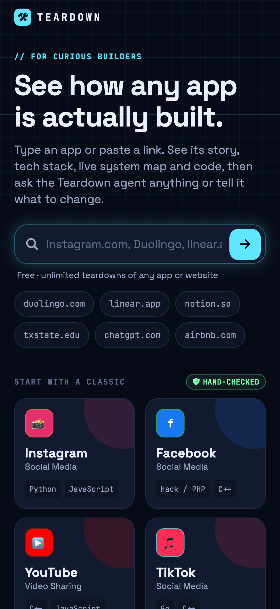
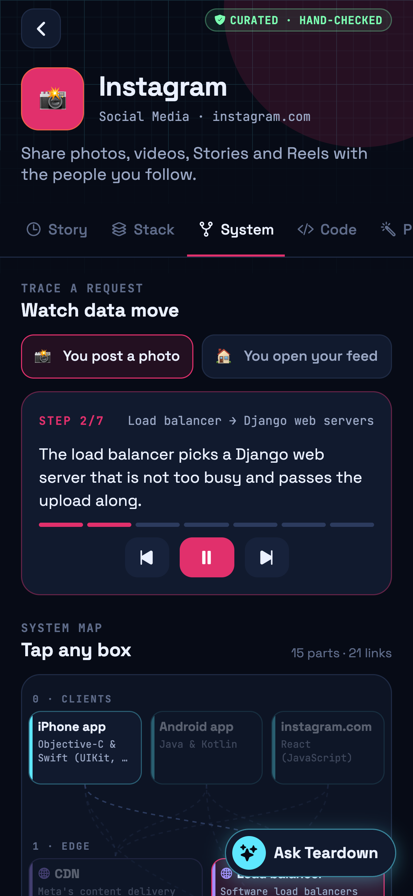
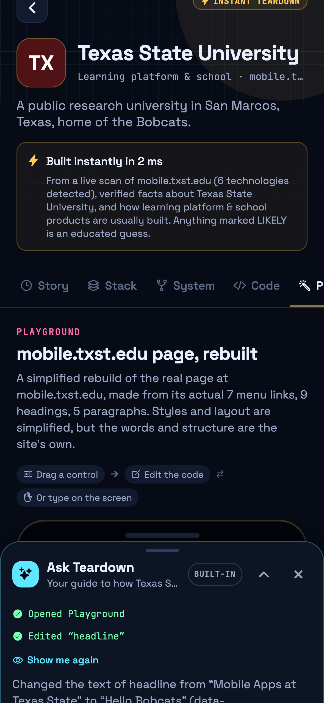
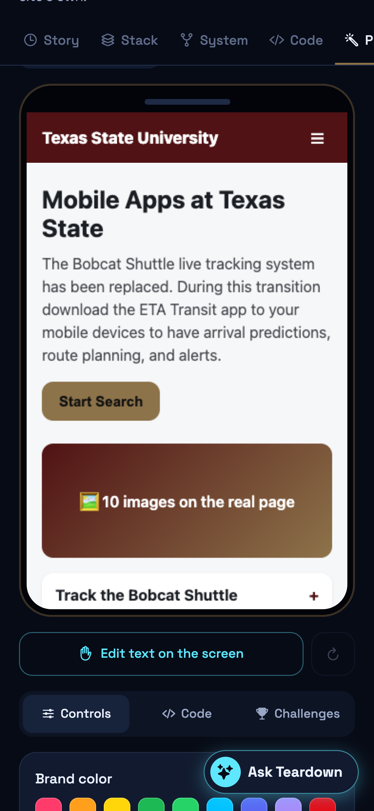
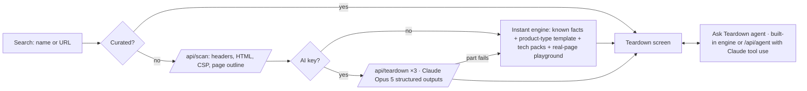

# Teardown: see how any app is actually built

You scroll past something amazing, like Instagram, and wonder how it works. Who built it? What language is it written in?
What happens between tapping ❤️ and your friend seeing it? **Teardown** answers that. Type an app name or paste a link
and you get an interactive breakdown made for beginner and intermediate CS students, plus an agent you can ask anything
or tell to change things.

Built at **TXST Shipaton 2026** (Texas State University, September 14, 2026), the local edition of RevenueCat Shipaton.

**Team:** _Name 1_ · _Name 2_ · _Name 3_ · _Name 4_

| Home | System map | Ask Teardown | Real-page playground |
| --- | --- | --- | --- |
|  |  |  |  |

---

## ✅ Built during the hackathon (September 14, 2026)

Everything in this repository was built during the event. The first commit is the blank `create-expo-app` template
from 12:10 PM; the rest of the history is the hackathon work. Everything listed here runs today:

- **Search any app or website** by name or URL.
- **14 curated teardowns** written from public sources and fact-checked against the web: Instagram, Facebook, YouTube,
  TikTok, Spotify, Netflix, X, Reddit, Discord, WhatsApp, Uber, Amazon, Google Search, ChatGPT.
- **Instant teardowns of any other site**, with no AI key required:
  - **Live scan** of the real site: 100+ header, HTML and security-policy fingerprints, each shown with its evidence.
  - **Known facts** for 105 popular products (founders, history, brand colours), fact-checked against the web.
  - **Product-type templates** for 14 kinds of product (social, commerce, education, and so on), filled with the
    detected tech.
  - **Tech explanations** for 74 technologies the scanner can detect.
- **Six tabs per teardown:**
  - **Story:** plain-English explanation, quick facts and a history timeline.
  - **Stack:** languages and layer-by-layer tech with *confirmed* vs *likely* badges, plus live-scan evidence.
  - **System:** interactive architecture map. Tap a box to see what it does, or play a request ("You post a photo") and
    watch it travel through the system with narration.
  - **Code:** syntax-highlighted teaching snippets and an illustrative project file tree.
  - **Playground:** a live mini-clone you can remix. Controls change the code, the code changes the screen, and typing on
    the screen changes the code. For scanned sites it rebuilds the real page from its actual menu, headings and text.
  - **Learn:** key concepts, a build-your-own roadmap and sources.
- **Ask Teardown agent:** a chat on every teardown that answers questions and drives the screen.
  - It highlights parts of the map, plays request flows, opens code and explains concepts.
  - It edits the playground on request ("make it dark mode", "rename the headline to Hello Bobcats").
  - It works offline with a built-in engine, tested on 228 scripted and 1,104 fuzzed prompts.
  - It uses Claude Opus 5 with tool use when `ANTHROPIC_API_KEY` is set.
- **Claude-generated teardowns** (with an API key): three parallel structured-output calls grounded in the live scan. Any
  part that fails falls back to the instant teardown.
- **Teardown Pro paywall with the RevenueCat SDK** (`src/lib/purchases.ts`, `src/app/paywall.tsx`): offerings, purchase,
  restore, plus a local demo mode when no key is set. It is switched off by default (see below).
- **Runs on iOS, Android and web** from one Expo codebase, with a custom icon and a dark "blueprint" design.

## 🔭 Future ideas (not built yet)

- Publish to the App Store and Google Play with live RevenueCat products and a free trial.
- Deploy the API (EAS Hosting) so phone builds work away from a laptop dev server.
- Scan JavaScript-rendered sites with a headless browser, so apps like Duolingo get real-page playgrounds too.
- Accounts and cloud sync for saved teardowns, playground remixes and chat history.
- Compare two apps side by side ("Instagram vs TikTok: how do their feeds differ?").
- Classroom mode for CS instructors: assign a teardown, quiz students, track progress.
- Community-submitted curated teardowns with review, like a Wikipedia for app architecture.
- Export a playground remix to CodePen or a GitHub repo.
- Voice mode for the agent, and support for more languages.

---

## Run it

```bash
npm install
cp .env.example .env        # optional: ANTHROPIC_API_KEY, RevenueCat keys, EXPO_PUBLIC_PAYWALL_ENABLED
npx expo start
```

- Press **w** for web, or scan the QR code with **Expo Go** on a phone on the same Wi-Fi.
- The API routes (`src/app/api/*+api.ts`) run inside the Expo dev server, so there's no separate backend.
- **No API key? Everything still works:** curated teardowns, instant teardowns, live scans, and the built-in Ask
  Teardown agent. With a key, Claude writes teardowns and powers the agent.

### Tests

```bash
npm run typecheck                                  # TypeScript
npx tsx scripts/validate-data.ts                   # curated teardowns (map links, flows, playground contract)
npx tsx scripts/validate-offline.ts                # templates, tech packs, known products
npx tsx scripts/test-quick-engine.ts --live        # instant teardowns incl. real sites (dev server running)
npx tsx scripts/test-agent.ts                      # built-in agent: 99 cases
npx tsx scripts/agent-battery.ts                   # built-in agent: 228 scripted + 1,104 fuzzed prompts
node scripts/mock-anthropic-agent.mjs & npx tsx scripts/test-agent-api.ts   # Claude agent route against a mock API
```

## RevenueCat (Teardown Pro)

The paywall is **off by default** so the app is free during judging. To turn it on:

1. At [app.revenuecat.com](https://app.revenuecat.com), create a project with an **entitlement** `pro` and a monthly
   package in the **current offering**.
2. Put the **Test Store** public key in `.env` as `EXPO_PUBLIC_REVENUECAT_API_KEY` (works in Expo Go and on web). Store
   builds use `EXPO_PUBLIC_REVENUECAT_IOS_KEY` / `EXPO_PUBLIC_REVENUECAT_ANDROID_KEY`.
3. Set `EXPO_PUBLIC_PAYWALL_ENABLED=true` and restart. Without keys, the paywall runs in a labelled demo mode.

## How it works



- **Honest by design.** What the scan proved and documented facts are marked *confirmed*; patterns and guesses are marked
  *likely*, and every instant teardown explains how it was built.
- **Agent drives the UI through a contract.** The agent returns actions (`src/lib/agent/types.ts`), such as
  `play_flow`, `highlight_node` and `set_tweak`. The app applies them through a shared workspace store
  (`src/lib/workspace.ts`), so the same actions work for the built-in engine and for Claude.
- **Playground contract.** CSS variables tagged `/* @tweak */` become controls, and `data-edit` elements become editable on
  screen. `src/lib/playground.ts` syncs code and preview both ways (WebView on native, sandboxed iframe on web).

```
src/app/                   screens (expo-router) + API routes (scan, teardown, agent, status)
src/components/panels/     Story, Stack, System, Code, Playground, Learn
src/components/agent/      Ask Teardown chat dock
src/data/curated/          14 curated teardowns
src/lib/offline/           instant engine: templates, tech packs, known products, real-page playground
src/lib/agent/             agent contract, built-in engine, chat store
submission/                Shipaton submission kit (deck text, demo script, screenshots)
```

## Honesty notes

- Code snippets and file trees are simplified teaching examples, not any company's private source code.
- Built with AI pair programming (Claude Code), with the team directing the product, design and content choices.
- The scanner blocks obvious private and localhost addresses, but it isn't a hardened proxy. Rate-limit it if you
  deploy it publicly.
